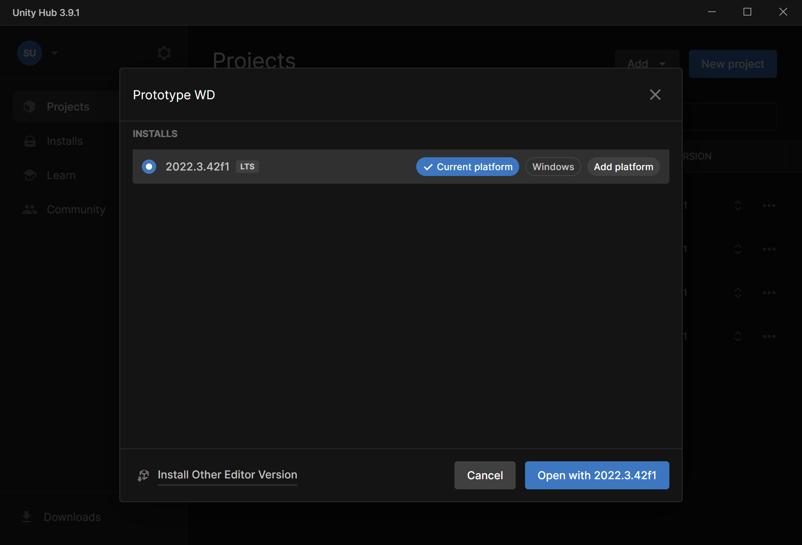
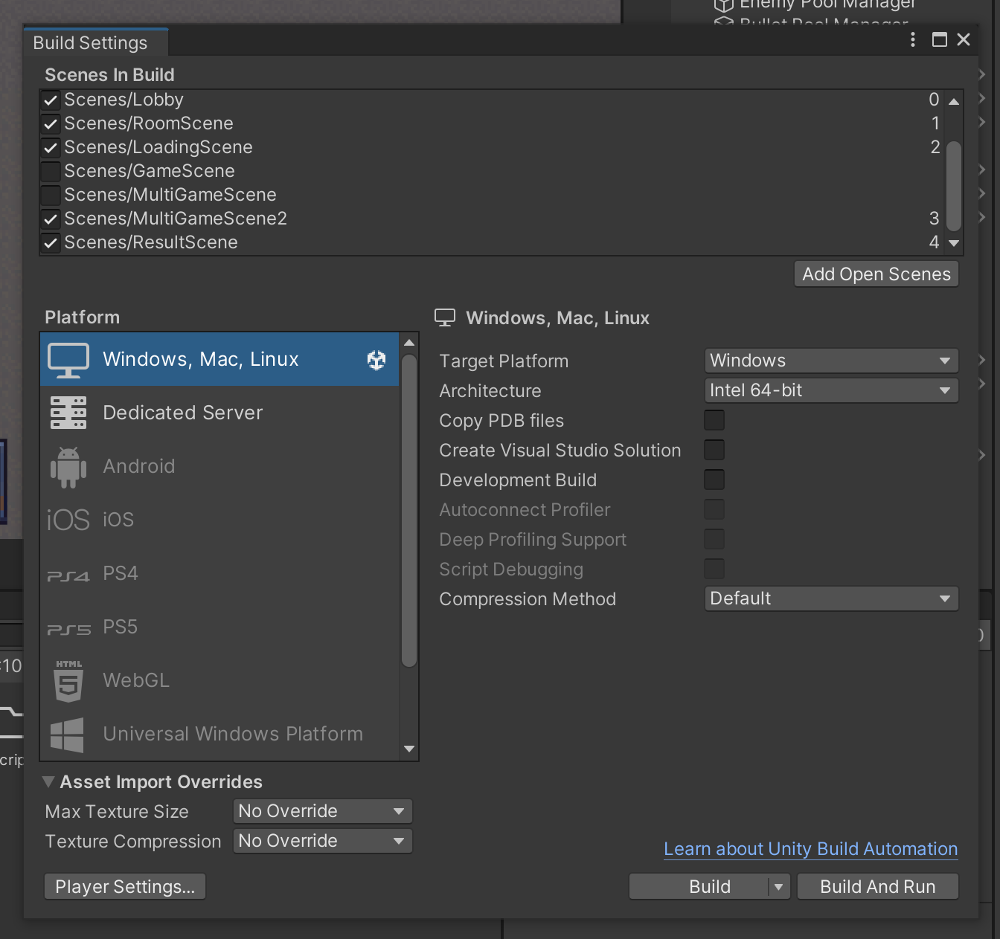
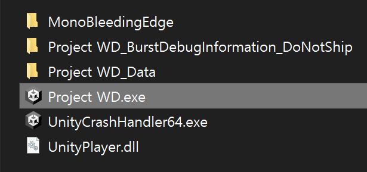
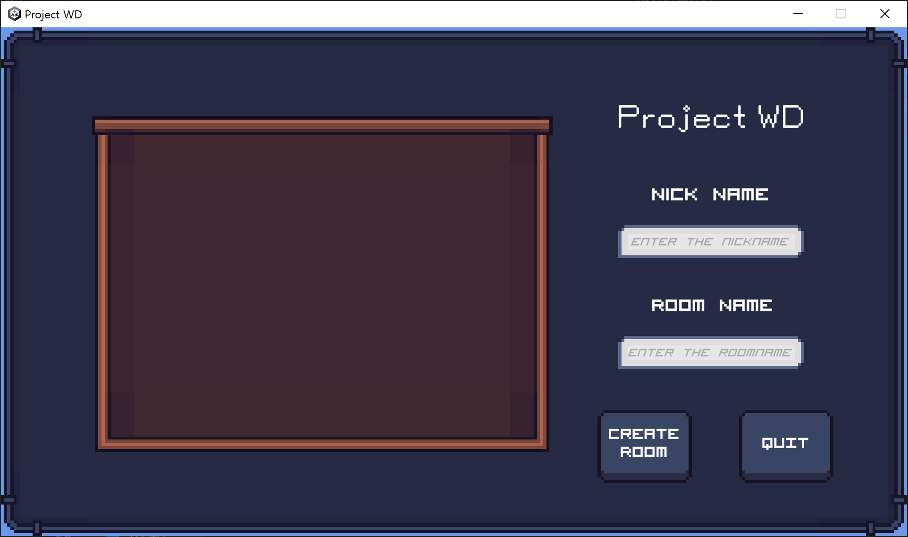
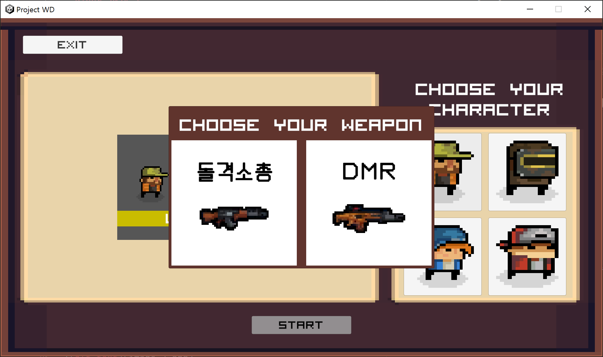
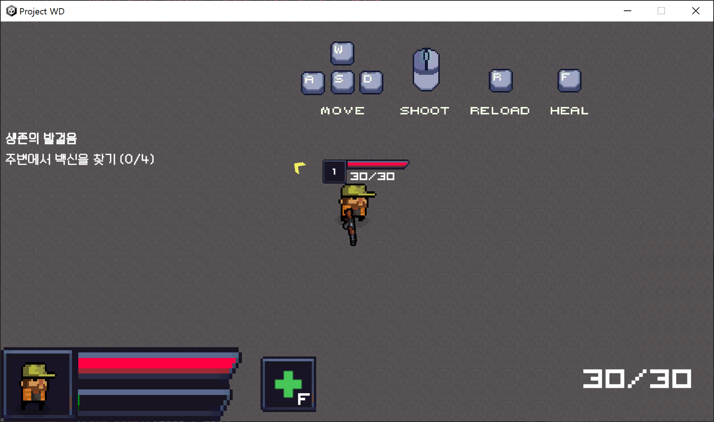

# Project WD 포팅 매뉴얼

## 개발 환경

- Unity Hub 3.9.1
- Unity 2022.3.42f1
- Rider 2024.2
- Aseprite 1.3.8.1
- git 2.45.2

## 빌드 방법
- Unity Hub를 실행하여 프로젝트 폴더를 로드하고, 버전에 맞는 Unity 에디터를 다운로드합니다.

- 프로젝트를 열고 상단 메뉴 File > Build Settings... 클릭
- Lobby, RoomScene, LoadingScene, MultiGameScene2, ResultScene 이 0부터 4까지 차례대로 Scenes In Build 리스트에 할당되어 활성화(체크 표시) 되어 있는지 확인

- 'Build' 버튼을 클릭하고 빌드 될 폴더를 선택하여 빌드합니다.
- 빌드가 완료되면 빌드 된 폴더가 자동으로 열립니다.
- 열린 해당 폴더에서 'Project WD.exe'를 실행합니다.

## 시연 시나리오

- 메인 페이지에서 닉네임과 방 이름을 지정하고 CREATE ROOM 버튼을 클릭합니다.

- 플레이 할 캐릭터를 클릭하고, 사용할 무기 종류를 선택합니다.

- START 버튼을 눌러서 시작합니다.
- 여러 사람이 접속한 멀티플레이 환경의 경우에는, 방장이 아닌 유저들이 모두 READY 한 다음에 

- 화면에 있는 조작방법을 참고하여, 노란색 화살표를 따라 미션을 클리어해나가며 게임을 플레이합니다.

